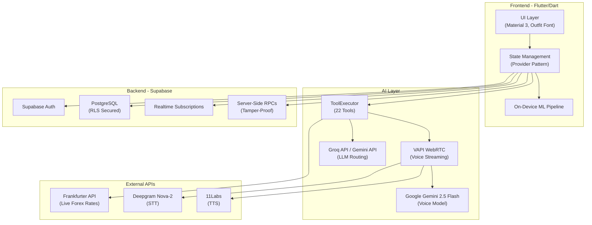

<div align="center">

</div>

# Expenso: Voice-Native Financial Agent

Expenso fundamentally redesigns personal finance by destroying UI friction. It’s not just an expense tracker—it represents a complete evolution into **autonomous wealth management**. Powered by **Niva AI** and **Supabase**, Expenso allows you to simply speak your transactions to handle multi-currency conversions, complex bill splitting, subscription management, and goal tracking seamlessly.

---

## 🔴 The Problem: Financial Literacy and the Friction of Daily Management

**Financial anxiety is a global epidemic, yet the tools designed to help us manage our money often feel like part of the problem. They are built for accountants, not for everyday people trying to build better habits.**

Millions of people struggle with financial literacy and fail to maintain consistent budgeting habits because current solutions are fundamentally broken:

1.  **Exclusion by Design (The Literacy Barrier):** Traditional apps assume you already know how to budget, categorize, and forecast. They provide raw charts but no guidance, leaving those who need financial literacy the most completely overwhelmed.
2.  **The Overwhelming Friction of Daily Use:** Logging a quick coffee or bus ticket takes 10–15 seconds of tapping, swiping, and categorizing. This macro-friction for micro-transactions leads to rapid user abandonment. You can't improve what you stop tracking.
3.  **Disconnected from Social Good & Community:** Managing debts with friends or splitting family bills is a social activity, yet expense trackers isolate you. They treat money as cold data rather than the flowing energy of our daily lives.
4.  **Zero Behavioral Engagement:** Saving money is delayed gratification, which human psychology struggles with. Without real-time nudges, emotional support, and gamified incentives, people easily fall back into destructive spending patterns.

## 🟢 The Solution: Voice-Native Financial Empowerment

**Expenso is a conversational, agentic financial ecosystem designed for everyone.** It eliminates UI friction and the financial literacy barrier by delegating the heavy lifting to an autonomous AI agent, **Niva**. Instead of tapping through dense menus, you simply *talk* to your app like a trusted financial advisor.

- **Zero-Friction Daily Logging:** VAPI WebRTC streams audio instantly. Say *"I spent 450 on lunch"* and the app intelligently categorizes and logs it in under 2 seconds. No typing, no menus.
- **Empowering Financial Literacy:** Niva doesn't just show charts; she explains them. Ask *"Why is my health score low?"* and she provides localized, jargon-free advice to help you build true financial literacy over time.
- **Agentic Social Intelligence:** Splitting a bill or recording a loan to a friend? Say *"Split the 1000 rupee dinner with Rahul"* and Niva invokes the `splitExpense` tool to manage your social debts instantly.
- **Gamified for Good:** Applied behavioral economics turns saving into a rewarding experience. Maintain streaks, earn X Coins, and defeat 'Spending Demons' to build healthy habits that last.
- **Offline-First:** Local Hive + SharedPreferences with Supabase cloud persistence. Soft-delete sync protocols ensure you never lose data, even offline.

---

## 🏗️ System Architecture

Expenso is structured as an offline-first, sync-capable, agent-driven architecture. The diagram below illustrates the exact data flow between the UI, the AI models, and the backend.



---

## 🧠 AI Agent Capabilities

Niva AI is natively bound to the application state through a robust `ToolExecutor` engine.

### Expense & Budget Orchestration

- **`addExpense` & `deleteExpense`**: Intelligently logs expenses with categorized tags/dates, or resolves historical transactions for deletion.
- **`setBudget` & `queryBudgetStatus`**: Re-adjusts global app budgeting or extracts remaining capacity globally/locally (e.g., _"Do I have enough left for Entertainment?"_).

### Advanced Financial Mathematics

- **`convertAndAddExpense`**: Live forex tracking. If a user states, _"I spent £40 pounds"_, the AI identifies their home currency, runs the exchange rate, and commits the localized value.
- **`splitExpense` & `addDebt`**: Peer-to-peer bill splitter logging bidirectional IOU contracts natively.
- **`analyzeSpendingTrend`**: Provides relative month-over-month comparisons to flag inflation or lifestyle drift.

### Deep Memory & Health

- **`queryPastExpenses`**: Localized RAG protocol. The agent queries specific dates/keywords against the local database to securely answer questions without dumping data to the cloud.
- **`getFinancialHealth`**: Calculates a global 0–100 dashboard health score based on velocity, budget adherence, and behavioral consistency.

### Global App State Management

- **`modifyGoal` & `deleteSubscription`**: Resolves goals/subscriptions by name to add funds, withdraw, or destroy them.
- **`changeTheme`, `changeCurrency`, `MapsTo`, `exportData`**: Full system control via voice commands.

---

## 🤖 On-Device ML Pipeline

Privacy-sensitive financial data shouldn't rely on cloud ML for basic operations. Expenso uses a custom pipeline built entirely in Dart:

1.  **Layer 1 (Auto-Categorization):** Tokenizer + TF-IDF Vectorizer + Logistic Regression predicts categories from expense titles.
2.  **Layer 2 (Anomaly Detection):** Statistics Engine calculates Mean, StdDev, and Z-Scores to flag unusual spending (Z-Score ≥ 2.5).
3.  **Layer 3 (Forecasting):** Least-squares Linear Regression on a 45-day window predicts month-end totals and daily burn rates.

---

## 🎮 Gamification Engine

Financial management fails when it gets boring. Expenso solves this via applied behavioral economics:

- **X Coins & Economics:** The core gamified currency mined by staying cleanly under budget.
- **Demon Bosses:** Visualized 'spending demons' representing budget drift. Users actively duel them by enforcing spending limits over multi-week periods.
- **Daily Streaks & Shields:** A persistent visual counter. Shields can be bought to protect streaks.
- **Profile Pins & Badges:** Unlockable cosmetic accolades incentivizing strong saving protocols.

---

## 📱 Application Walkthrough

- **Dashboard (The Command Center):** Features a dynamic Financial Health Gauge (0-100), remaining budget visualizations, and the pulsing Niva Orb for instant voice access.
- **Voice Interaction (WebRTC):** Tapping the orb opens a secure WebRTC pipeline. Speech is transcribed instantly, parsed by the Groq/Gemini models, and executed via JSON tool calls in zero latency.
- **Agentic Chat & Insights:** Tapping the Health Gauge opens a chat interface for local RAG queries (_"Why is my health score low?"_), providing targeted corrective advice.
- **Deep Ecosystem Tabs:** Dedicated views for Goals, Subscriptions, and Contacts, all fully manipulable via voice.
- **Gamification Profile:** Track XP, equip Pins, and battle the active weekly Spending Demon.

---

## 🌍 Practical Use Cases

1.  **Consumer FinTech:** Reduces transaction logging friction from 10+ seconds to 2 seconds, while solving retention via gamification.
2.  **Banking & Neobanking Integration:** The extensible `ToolExecutor` pattern can act as a white-label voice assistant for existing banking apps.
3.  **Financial Inclusion:** Voice-first interfaces eliminate literacy barriers for financial management in emerging markets.
4.  **Gen Z Financial Literacy:** Boss battles and XP leveling create an emotional connection to budget adherence for younger demographics.

---

## ⚡ Getting Started (Developer Setup)

### 1\. Clone the Repository

```bash
git clone https://github.com/your-username/expenso-niva.git
cd expensoAI
```

### 2\. Environment Configuration

Create a `.env` file in the root directory and explicitly configure your required API keys:

```env
# Supabase Secrets (Core DB)
SUPABASE_URL=your_supabase_url
SUPABASE_ANON_KEY=your_supabase_anon_key

# AI & Agentic Voice Models
GROQ_API_KEY=your_groq_api_key
GEMINI_API_KEY=your_gemini_api_key
VAPI_PUBLIC_KEY=your_vapi_public_key
```

### 3\. Install & Run

Resolve dependencies and launch the application.

```bash
flutter pub get
flutter run
```

---

**Built with ❤️ for financially smarter, conversational money management.**

_Questions? Ask Niva\!_
