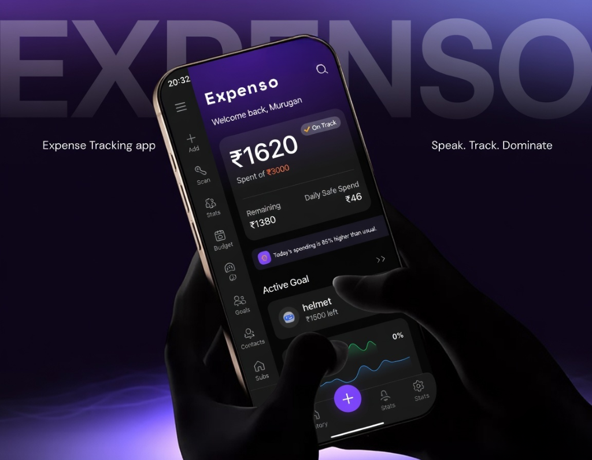

<div align="center">
  
</div>

# Expenso: Voice-Native Financial Agent

Expenso fundamentally redesigns personal finance by destroying UI friction. It’s not just an expense tracker—it represents a complete evolution into **autonomous wealth management**. Powered by **Niva AI** and **Supabase**, Expenso allows you to simply speak your transactions to handle multi-currency conversions, complex bill splitting, subscription management, and goal tracking seamlessly.

---

## 🔴 Problem Statement
Personal financial management applications suffer from an overwhelming friction-to-value ratio. While knowing where our money goes is vital, users systematically abandon traditional expense trackers because they demand exhaustive manual data entry, endless drop-down menu sorting, and fragmented navigation to separately manage spending, shared bills, goals, and digital subscriptions. Furthermore, when users finally input their data, apps fail to provide actionable context—often presenting static charts rather than intelligent explanations regarding *why* their financial trajectory shifted.

## 🟢 Project Description
**Expenso** is a comprehensive, zero-UI financial ecosystem powered by an autonomous LLM capability (Niva AI) and a highly robust, real-time Supabase infrastructure. 

Rather than physically managing transactions, Expenso enables users to simply speak their financial reality. Using structured LLM function-calling on the device, Niva autonomously executes complex workflows: processing multi-currency exchanges via live API rates, calculating customized bill splits instantly against a user's Contacts, logging debts, updating goals, and categorizing payments seamlessly into the background database. 

Furthermore, instead of dangerous data-dumps, Expenso features a localized RAG-powered agentic chat. Users can question their 'Financial Health Score', empowering the AI to selectively semantically query their historical ledger and translate static spending gaps into actionable conversational advice. To ensure long-term behavioral change, the entire environment is natively gamified—rewarding financial discipline directly via daily streaks, specialized X Coins, demon boss battles, and unlockable profile badges. Expenso deletes friction and delegates the mechanics of wealth tracking entirely to intelligence.

---

## 🏗️ System Architecture

Expenso is structured as an offline-first, sync-capable, agent-driven architecture:

1.  **Frontend Node:** Built entirely in **Flutter** (Dart), supplying a smooth 120hz cross-platform fluid UI focused on visual gamification.
2.  **State Management & Logic:** Provider architecture tracks `ExpenseProvider`, `GoalService`, `SubscriptionProvider`, and `FinancialMemoryService` locally.
3.  **Cloud & Persistence Layer (Supabase):** Expenso operates offline natively, actively pushing and pulling from **Supabase PostgreSQL** exclusively when network coverage allows. It handles Row Level Security (RLS) securely syncing encrypted ledgers across sessions.
4.  **AI Voice Engine (VAPI + Daily WebRTC):** Instead of waiting for API responses, voice is streamed bidirectionally in real time via **VAPI**, resulting in sub-500ms conversational latency with active interruption protocols. 
5.  **Inference Core (Groq + Llama 3 70B):** Niva AI executes structured JSON mapping via **Llama-3-70b-versatile** on the Groq ASIC platform, mapping natural language identically to the Dart functions in the background.

---

## 🧠 AI Agent Capabilities (Tool Architecture)

Expenso’s Niva AI doesn't just talk—she acts. The LLM is natively bound to the application state through a robust `ToolExecutor` engine. Below are the autonomous capabilities baked into the agent:

### Expense & Budget Orchestration
*   **`addExpense`**: Intelligently logs standard expenses with categorized tags and dynamic dates based on context (e.g., "I bought coffee yesterday").
*   **`deleteExpense`**: Resolves historical transactions and deletes targeted rows by their UUID mappings.
*   **`setBudget`**: Calculates existing spend and re-adjusts global app budgeting via voice directive.
*   **`queryBudgetStatus`**: Extracts the specific remaining capacity either globally or within an isolated category (e.g., "Do I have enough left for Entertainment?").

### Advanced Financial Mathematics
*   **`convertAndAddExpense`**: Uses live forex tracking. If a user states, *"I spent £40 pounds"*, the AI automatically identifies their base home currency, runs the exchange rate logic, and commits the localized value perfectly.
*   **`splitExpense`**: A peer-to-peer bill splitter. The AI calculates fractions of an expense and automatically binds a debt constraint directly to a specific user inside local Contacts.
*   **`addDebt`**: Logs bidirectional IOU contracts natively (e.g., "Rahul owes me $20", or "I owe Sarah $10").
*   **`analyzeSpendingTrend`**: Provides relative month-over-month comparisons dynamically parsing semantic strings like *"this_month"* versus *"last_month"* to flag inflation or lifestyle drift.

### Deep Memory & Health
*   **`queryPastExpenses`**: Localized RAG protocol. Instead of dumping massive historical context into the cloud, the agent actively queries specific dates, months, or semantic keywords against the local database to securely answer questions.
*   **`getFinancialHealth`**: Calculates the global 0–100 dashboard health score based on velocity, budget adherence, and behavioral consistency logic.

### Global App State Management
*   **`modifyGoal`**: Resolves lifetime financial Goals by Name recursively to add funding, withdraw partial funds, or destroy the goal entirely (with explicit user verification boundaries).
*   **`deleteSubscription`**: Isolates recurring subscriptions and destroys them by name.
*   **`changeTheme`**: Adjusts system rendering (Dark, Light, AMOLED logic).
*   **`changeCurrency`**: Modifies the global UI base currency.
*   **`exportData`**: Silently structures all transactions into a local CSV and opens the OS native sharing sheet.
*   **`navigateTo`**: Triggers Flutter router layers to swap UI screens entirely via voice commands (e.g., "Show me my graphs").

---

## 🎮 Gamification Engine

Financial management fails when it gets boring. Expenso solves this via applied behavioral economics:
*   **X Coins & Economics:** The core gamified currency. Staying cleanly under budget directly mines coins.
*   **Daily Streaks:** A persistent visual counter incrementing when users log actions and avoid bad debt.
*   **Demon Bosses:** Visualized 'spending demons' representing budget drift that users actively duel and defeat by enforcing spending limits over multi-week periods.
*   **Profile Pins & Badges:** Unlockable cosmetic accolades incentivizing strong localized saving protocols.

---

## 📱 Application Walkthrough & Logic Flow

An exhaustive step-by-step visual and logical tour of the Expenso ecosystem:

### 1. Onboarding & Authentication
*   **What You See:** A clean, minimalistic login screen seamlessly dropping into an onboarding flow to securely capture the user's Name, preferred Base Currency, and their ideal Monthly Budget.
*   **The Logic:** Supabase handles secure magic-link/password authentication. The initialization visually locks the currency and maps the base `ExpenseProvider` to the local SQLite/Cloud synchronizer so all future LLM math is permanently grounded in the correct forex scalar.

### 2. The Main Dashboard (The Command Center)
*   **What You See:** 
    *   **The Header:** Displays "Welcome back, [Name]" alongside a dynamic pill-badge showing the active **Daily Streak**, total **X Coins**, and unlocked **Profile Badges**.
    *   **The Financial Health Gauge:** A massive, sleek semi-circle gauge displaying a score from 0-100 and a subtext grade (e.g., 'Excellent', 'Needs Attention').
    *   **The Summary Card:** A minimalist breakdown of exactly how much budget remains visually compared to the daily burn rate.
    *   **The Niva Orb:** A softly pulsing, futuristic floating action button sitting at the bottom right.
*   **The Logic:** The Health Gauge is calculated synchronously directly on the device upon rendering. It derives a 0-100 score mathematically based on 3 pillars: Budget Adherence (40%), Spending Consistency/Variance (30%), and Month-Over-Month Deflation (30%). If the user's spending velocity accelerates recklessly, the gauge dynamically penalizes the score.

### 3. Voice Interaction (Niva AI WebRTC)
*   **What You See:** Tapping the Niva Orb dims the background and brings up a sleek soundwave visualizer indicating the agent is actively listening. The user speaks, and Niva replies intelligently in zero latency.
*   **The Logic:** Tapping the orb triggers **VAPI**. It opens a secure WebRTC pipeline to stream audio natively. The speech is transcribed to text instantly and parsed by the Groq Llama-3 inference model configured with Expenso's specific System Prompt. The model emits structured JSON tool calls (like `convertAndAddExpense`). The app physical parses these tools, writes them to the Supabase database/local storage, and returns a success payload to the LLM, which then verbally informs the user via synthesized speech structure!

### 4. Text-Based Agentic Chat & Insights
*   **What You See:** If the user taps the top Financial Health Gauge directly, a clean, chat-bubble interface slides up. The AI pre-populates the prompt with *"Why is my health score XYZ?"* and proceeds to print out an intelligent explanation.
*   **The Logic:** This triggers the local Agentic RAG system natively. The interface spawns an asynchronous search using the `queryPastExpenses` tool. By restricting history fetches to targeted queries, it physically bypasses massive LLM token bounds. The AI interprets the exact logic of the budget variance, explains it to the user textually, and offers targeted corrective advice.

### 5. Deep Ecosystem Tabs (Goals, Subscriptions, Contacts)
*   **What You See:** Navigating via the bottom bar (or just asking Niva to "Open my Goals") brings up dedicated cards monitoring lifetime goals (e.g., "Buy a Mac") and recurring monthly subscriptions.
*   **The Logic:** The `GoalService` and `SubscriptionProvider` natively monitor these metrics. The LLM handles them seamlessly. If you say "Delete my Netflix subscription," Niva runs a targeted fuzzy-match search against the database string "Netflix", extracts its native UUID hidden in the background, executes the deletion command, and prompts the UI to structurally rebuild the screen visually.

### 6. Gamification & Boss Battles (Profile Screen)
*   **What You See:** Tapping your avatar reveals your Gamification page. Here, you see unlocking tiers of aesthetic minimal Pins, an XP bar, and a localized 'Spending Demon' boss with an active health bar.
*   **The Logic:** Expenso monitors user consistency centrally via `GamificationProvider`. Logging consecutive actions builds Streaks securely. Remaining under daily pacing awards X Coins. If spending goes significantly chaotic, the 'Demon Boss' HP rises proportionally. By managing budgets securely over time, the user deals "damage" to the demon boss, bridging behavioral financial discipline securely into dopamine-driven mechanics.

---

## ⚡ Getting Started (Developer Setup)

### 1. Clone the Repository
```bash
git clone https://github.com/your-username/expenso-niva.git
cd expenso-niva
```

### 2. Environment Configuration
Create a `.env` file in the root directory and explicitly configure your required API keys:
```env
# Supabase Secrets (Core DB)
SUPABASE_URL=your_supabase_url
SUPABASE_ANON_KEY=your_supabase_anon_key

# AI & Agentic Voice Models
GROQ_API_KEY=your_groq_api_key
VAPI_PUBLIC_KEY=your_vapi_public_key
```

### 3. Install Configurations
Resolve dependencies to populate WebRTC structures.
```bash
flutter pub get
flutter run
```


**Built with ❤️ for financially smarter, conversational money management.**

*Questions? Ask Niva!*